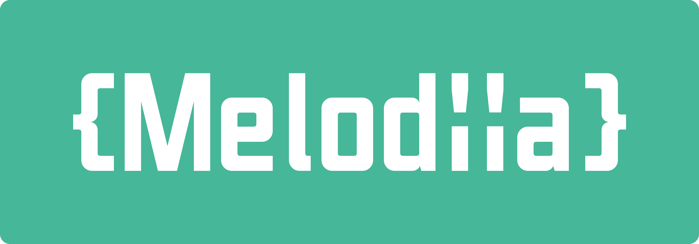

Melodiia
========


Finally some competitor to ApiPlatform.



Melodiia has been designed to do exactly what you want it does. No magic here. It's just a set of tools that
work nicely with Symfony.

Features
--------

- Adds a documentation endpoint with help of swagger
- Set of api responses
- Uses Symfony Form as input
- CRUD controllers
- Error management
- Output format as [json-api](https://jsonapi.org/), a format that has 1.x version

Learn more in the [complete documentation](https://melodiia.swag.industries).

Install
-------

```bash
composer require swag-industries/melodiia
```

The recipe will automatically create the configuration file `melodiia.yaml`. If you decided to not execute this recipe,
please refer to the
[recipe repository of Symfony](https://github.com/symfony/recipes-contrib/tree/master/swag-industries/melodiia).


You may want to read the [getting started doc](./docs/getting-started.md) at this point!

One last thing
--------------

I ([Nek-](https://github.com/Nek-)) designed Melodiia while I was working at Biig in the mean time. This [presentation of Melodiia @Biig-io](https://docs.google.com/presentation/d/1dtxUOzZFGRq7Ar5YV5aZ6AN60RhDbf_0OcXKj5iiDS8/edit?usp=sharing) is related to an old version of Melodiia but can still helps you to understand what is melodiia and how it's different from API Platform (TL;DR: Melodiia does less).

Feel free to open an issue, if you encounter problems while implementing Melodiia.

FAQ
---

### Blank page on documentation

You probably forget to install assets. `bin/console assets:install`.
